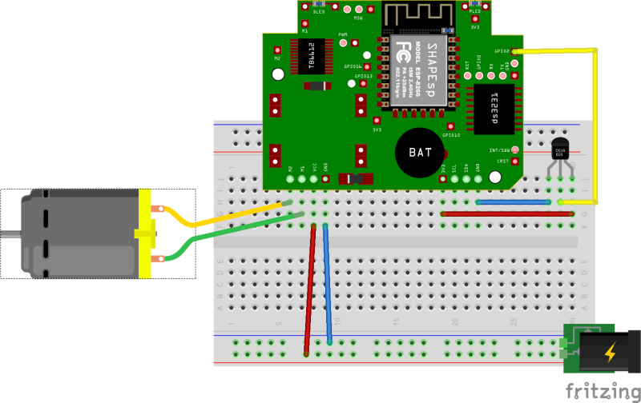
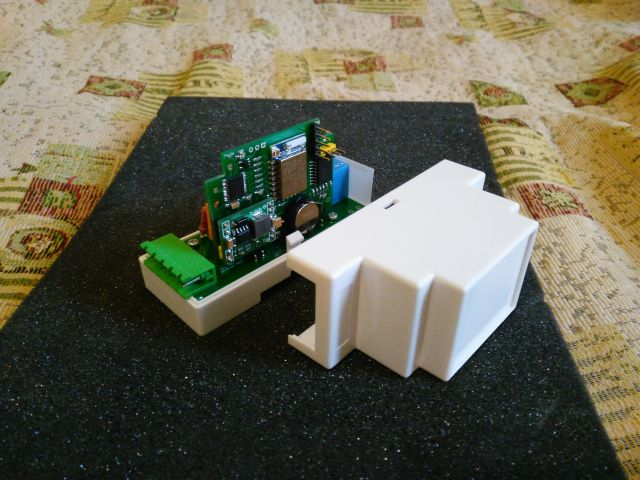
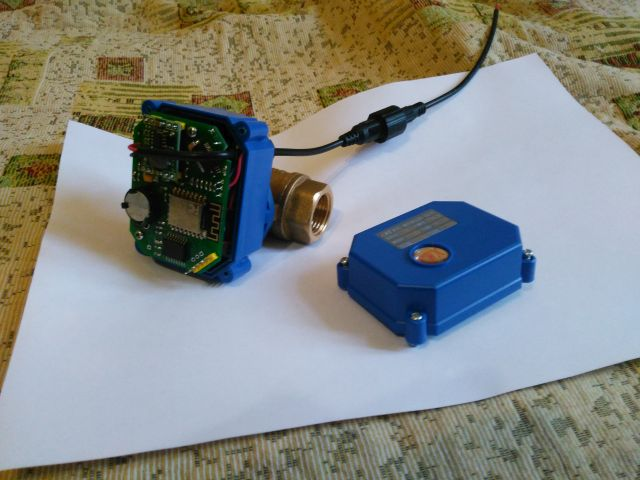

# SHAPEsp
> Draft version.

SHAPEsp - Esp8266 based Smart Home Automation Platform

Main goals of this project:
  - One PCB fits in differnt lowcost cases avialable from AliExpress (cheap blue motorized ball valve, DIN rail case etc).
  - Can be flashed with ESPurna firmware
  - Can directly control DC-motor or Relay via H-bridge TB6612
  - Can keep local time in onboard battery backed DS3231 clock
  - DC power supply 5-12v
  - I2C bus for additional functions/sensors (for examle BME280 sensor can be connected)
  - some free|configurable ESP8266 Pins available for user (for example Dallas ds1820 can be connected or water sensor(from Ali))
  - additional 3V3 and GND pins
  

# Fritzing diagram

# Photo

